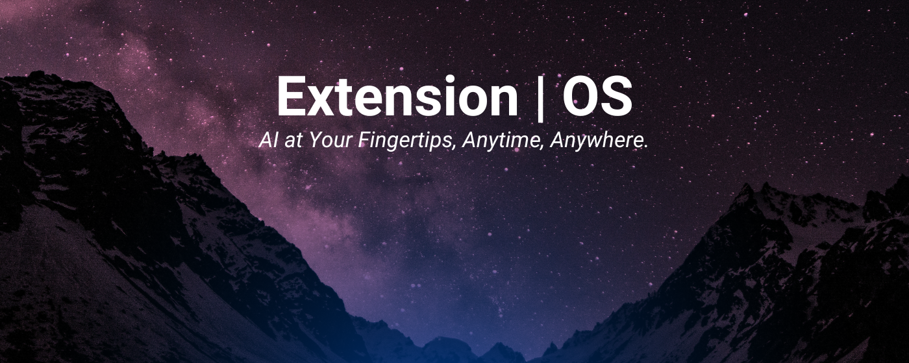
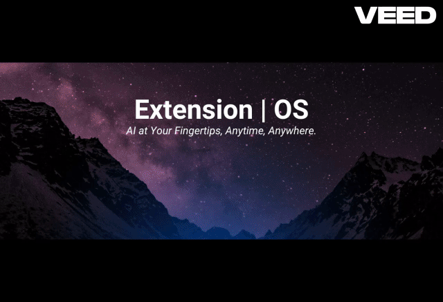

# Extension | OS



⭐️ Welcome to Extension | OS

## **Tired of the endless back-and-forth with ChatGPT, Claude, and other AI tools just to repeat the same task over and over?**

You're not alone! I felt the same frustration, so I built a solution: **Extension | OS**—an open-source browser extension that makes AI accessible directly where you need it.

**Imagine**: You create a prompt like "Fix the grammar for this text," right-click, and job done—no more switching tabs, no more wasted time.



> Imagine a world where every user has access to powerful models (LLMs and more) directly within their web browser. By integrating AI into everyday internet browsing, we can revolutionise the way people interact with information online, providing them with instant, intelligent assistance tailored to their needs.

## Pre-release on Google Chrome Store

Join an exclusive group of up to 100 early adopters and be among the first to experience the future of AI-powered browsing!

[](https://chromewebstore.google.com/detail/bahjnakiionbepnlbogdkojcehaeefnp)

[link-chrome]: https://chromewebstore.google.com/detail/bahjnakiionbepnlbogdkojcehaeefnp "Version published on Chrome Web Store"

- [][link-chrome] also compatible with [][link-chrome] [][link-chrome] [][link-chrome]

## Help me grow this extension

Use my affiliation code when you sign-up on VAPI: https://vapi.ai/?aff=extension-os

## 🚀 Getting started

1. Clone the extension or [download the latest release](https://github.com/albertocubeddu/extensionOS/releases/).
2. Open the Chrome browser and navigate to [chrome://extensions](chrome://extensions).
3. Enable the developer mode by clicking the toggle switch in the top right corner of the page.
4. Unpack/Unzip the `chrome-mv3-prod.zip`
5. Click on the "Load unpacked" button and select the folder you just unzipped.
6. The options page automatically opens, insert your API keys.

## ✨ Features

- **Prompt Factory**: Effortlessly Tailor Every Prompt to Your Needs with Our Standard Installation.
- **Prompt Factory**: Choose the Functionality for Every Prompt: From Copy-Pasting to Opening a New Sidebar.
- **Seamless Integration**: Effortlessly access any LLM model directly from your favorite website.
- **Secure Storage**: Your API key is securely stored in the browser's local storage, ensuring it never leaves your device.
- **[Beta] Mixture of Agents**: Experience the innovative Mixture Of Agents feature.

## Why

On the morning of July 27th, 2024, I began an exciting journey by joining the SF Hackathon x Build Club. After months of refining the concept in my mind, I decided it was time to bring it to life. I worked on enhancing my idea, updating what I had already created, and empowering everyone to unleash their creativity with custom prompts.

### Data - Awareness

All your data is stored locally on your hard drive.

### Pull Image

Example:

```
ollama pull llama3.1
```
